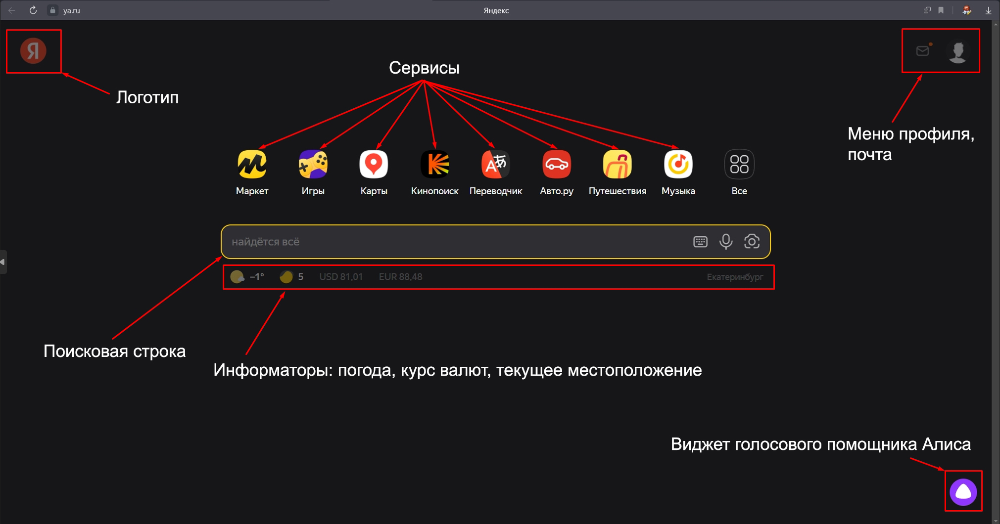
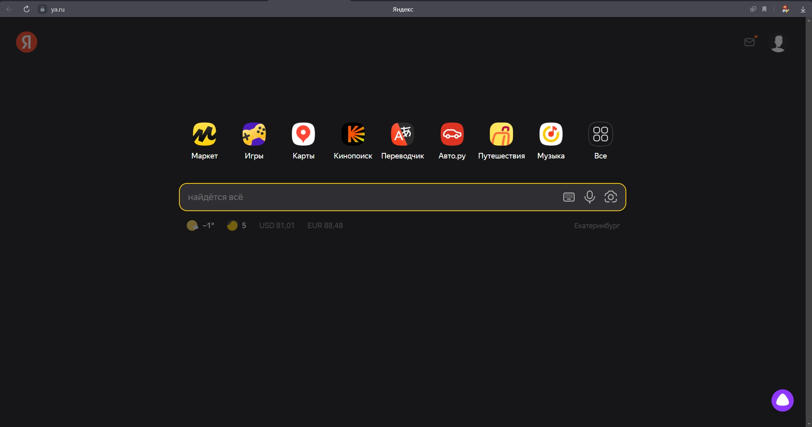
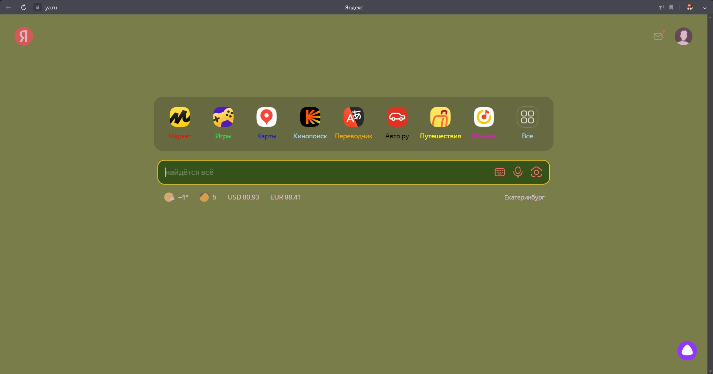
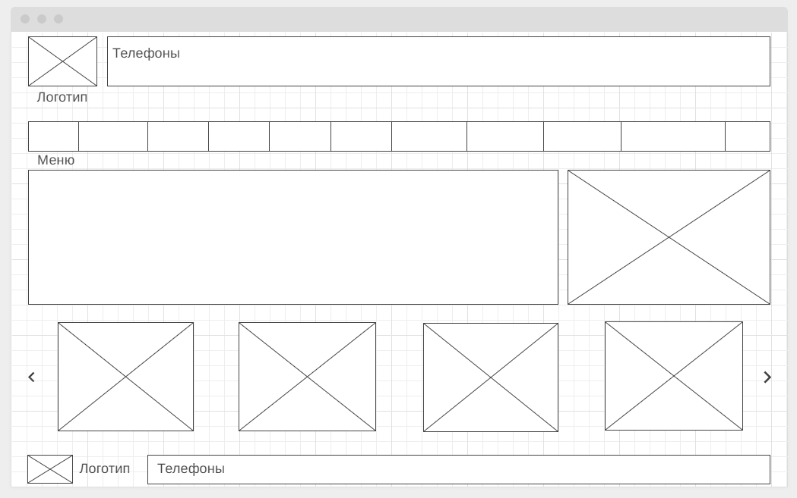

# Web technologies. Workshop1

## ДЗ: на основе сайта yandex.ru:
* Определите, на каком протоколе работает сайт.

*Ответ: Сайт работает по протоколу HTTPS. Сертификат действителен до 2 августа 2023 г.*

* Проанализируйте структуру страницы сайта

* Внесите не менее 10 изменений на страницу с помощью инструмента разработчика и представьте скриншоты было/стало.

*Было:*

*Стало:*

* Создайте прототип низкой детализации (дополнительное задание, если на семинаре дошли до задания №8)

